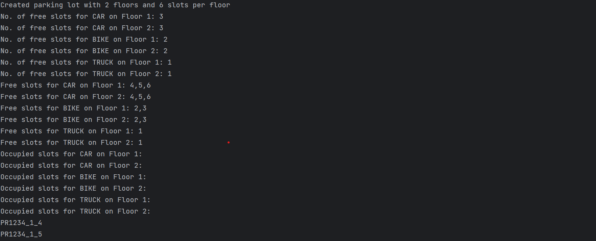
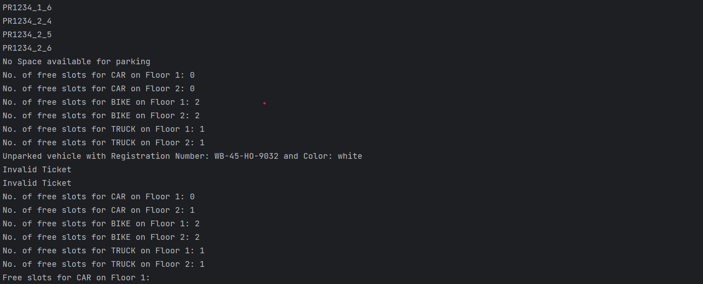
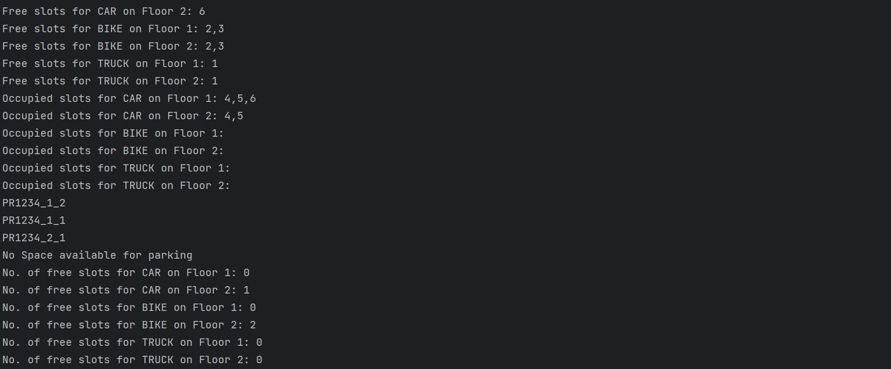
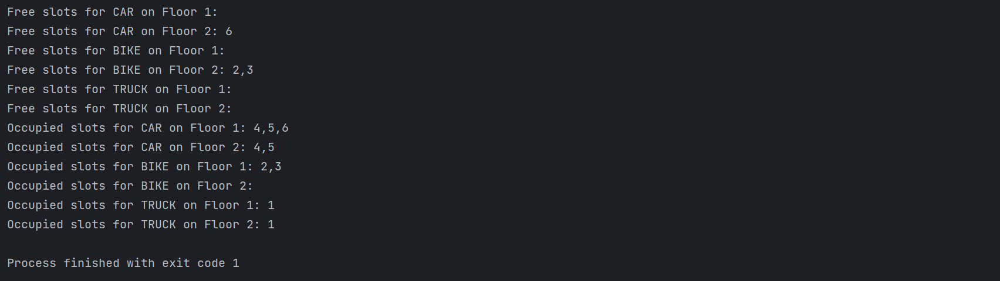

# Parking Lot

This is the solution to question

https://workat.tech/machine-coding/practice/design-parking-lot-qm6hwq4wkhp8

It satisfies all the requirement mentioned in the problem statement of it

1. Create the parking lot.
2. Add floors to the parking lot.
3. Add a parking lot slot to any of the floors.
4. Given a vehicle, it finds the first available slot, books it, creates a ticket, parks the vehicle, and finally
   returns the ticket.
5. Unparks a vehicle given the ticket id.
6. Displays the number of free slots per floor for a specific vehicle type.
7. Displays all the free slots per floor for a specific vehicle type.
8. Displays all the occupied slots per floor for a specific vehicle type.

To run the program simply run the main function and start giving input in valid format.

To test input uncomment the function **testInput()** from the main function
Output of the query against test input

